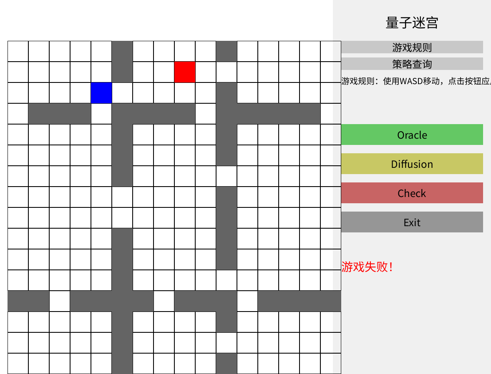

# 量子大富翁 Quantum Billionaire

一款融合量子计算知识与策略玩法的教育类桌游

## 🎯 项目简介

《量子大富翁》是一款基于经典“大富翁”机制开发的教育类游戏，玩家在投骰前行、触发事件的过程中，通过参与各类量子小游戏来获得资源、调整与测量 qubit，最终得到最多积分者获胜。

游戏巧妙地将 Grover 搜索、Simon 算法、量子炸弹检测、量子传态等核心量子算法转化为趣味互动机制，让玩家在轻松氛围中体验量子世界的奇妙逻辑。

本项目基于 https://github.com/ThoseBygones/OUC_Billionaire 进行开发，在此致谢原作者。

## 🎮 游戏机制

回合流程

两名玩家轮流进行以下操作：
	1.	掷骰并移动棋子
	2.	可使用背包中的物品（如量子门、卡片等）
	3.	根据落点触发事件格，包括：
	•	进入商店购买 qubit 或量子门
	•	启动小游戏赢取资源
	•	随机获得 qubit 或卡牌

胜利判定
	•	游戏在限定回合数后结束
	•	所有 qubit 进行测量（以 $|\ket{0}\rangle$ 和 $|\ket{1}\rangle$ 为基）
	•	每个 $|\ket{1}\rangle$ 计为 1 分，总分高者胜出

策略重点
	•	合理使用量子门，提升 qubit 被测为 $|\ket{1}\rangle$ 的概率
	•	通过小游戏、商店或事件格获取更多资源
	•	可利用卡牌干扰对手，例如偷取 qubit 等操作

## 🧪 主要小游戏

### 🌌 量子迷宫：Grover 搜索

玩家在 $16 \times 16$ 的迷宫中寻找唯一的目标格，通过交替应用 Oracle 和扩散操作放大目标的概率分布，并根据系统提示判断移动方向。若操作顺序或次数错误，会导致目标状态概率降低。

### 💣 黑盒实验：量子炸弹检测

玩家需判断一个黑盒中是否放有“炸弹”（测量设备），并设法避免引爆它。通过精细旋转和不同基底测量，可以尝试实现量子泽诺效应来“冻结”量子态，获得信息同时避免崩塌。

### 🔍 众里寻s千百度：Simon 算法

在一个满足 $f(x) = f(x \oplus s)$ 的黑盒函数中，玩家需找出隐藏的 s。可以选择完全量子操作组合，也可以通过半量子或经典方式破解，但所需成本与效率各不相同。

### 🧪 急速传送：量子态偷取

玩家模拟量子传输过程，通过共享 EPR 对、测量、选择 Pauli 门操作，实现对目标玩家 qubit 状态的传送还原。贝尔测量结果随机生成，玩家需判断合适的修正操作。

## ⚙️ 技术亮点
	•	游戏中每个量子机制都有真实算法作为支撑，确保科学性与可解释性
	•	所有量子态与操作都可实时显示，帮助玩家观察叠加态与概率演化
	•	不同操作设有经济成本，引导玩家在知识探索与资源利用之间做出决策
	•	教育性与可玩性并重，适合课堂教学、科普展示或个人兴趣学习

## 👥 开发者分工

| 姓名       | 职责说明                                               |
|------------|--------------------------------------------------------|
| Wang Han   | 设计并实现 Simon 算法小游戏与量子炸弹检测小游戏       |
| Liu Chang  | 开发主地图、商店系统及 Grover 迷宫小游戏              |
| Wang Yuxuan| 完成量子传输小游戏、背包系统、道具与 qubit 随机掉落、掷骰控制等核心功能 |

## 🔗 项目致谢

本项目参考并改编自原项目：https://github.com/ThoseBygones/OUC_Billionaire
